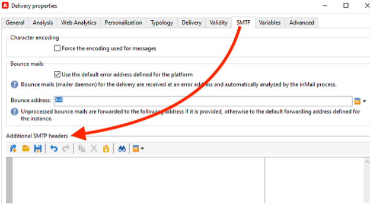

# Campaign Classic - 技術建議 {#technical-recommendations}

以下列出您在使用Adobe Campaign Classic時可用來改善傳遞率的幾項技術、設定和工具。

## 設定 {#configuration}

### 反向DNS {#reverse-dns}

Adobe Campaign會檢查是否為IP位址指定反向DNS，而且這會正確指向IP。

網路組態中很重要的一點是，要確保為傳出訊息的每個IP位址都定義了正確的反向DNS。 這表示對於指定的IP位址，會有反向DNS記錄（PTR記錄），且有相符的DNS （A記錄）回送至初始IP位址。

反向DNS的網域選擇在處理某些ISP時會產生影響。 尤其是AOL，它只接受與反向DNS位於相同網域中的位址回圈(請參閱 [回饋迴路](#feedback-loop))。

>[!NOTE]
>
>您可以使用 [此外部工具](https://mxtoolbox.com/SuperTool.aspx) 以驗證網域的設定。

### MX規則 {#mx-rules}

MX規則（郵件交換器）是管理傳送伺服器與接收伺服器之間通訊的規則。

更準確地說，它們用於控制Adobe Campaign MTA （訊息傳輸代理程式）傳送電子郵件給每個個別電子郵件網域或ISP (例如，hotmail.com、comcast.net)的速度。 這些規則通常以ISP發佈的限製為基礎（例如，每個SMTP連線請勿包含超過20則訊息）。

>[!NOTE]
>
>如需Adobe Campaign Classic中MX管理的詳細資訊，請參閱 [本節](https://experienceleague.adobe.com/docs/campaign-classic/using/installing-campaign-classic/additional-configurations/email-deliverability.html#mx-configuration).

### TLS {#tls}

TLS （傳輸層安全性）是一種加密通訊協定，可用來保護兩個電子郵件伺服器之間的連線，並防止預期收件者以外的任何人讀取電子郵件的內容。

### 寄件者的網域 {#sender-domain}

若要定義用於HELO命令的領域，請編輯執行個體的組態檔(conf/config-instance.xml)並定義「localDomain」屬性，如下所示：

```
<serverConf>
  <shared>
    <dnsConfig localDomain="mydomain.net"/>
  </shared>
</serverConf>
```

MAIL FROM網域是技術退信中所使用的網域。 此位址是在部署精靈中定義或透過NmsEmail_DefaultErrorAddr選項定義。

### SPF記錄 {#dns-configuration}

SPF記錄目前可在DNS伺服器上定義為TXT型別記錄（代碼16）或SPF型別記錄（代碼99）。 SPF記錄採用字元字串的形式。 例如：

```
v=spf1 ip4:12.34.56.78/32 ip4:12.34.56.79/32 ~all
```

將兩個IP位址12.34.56.78和12.34.56.79定義為已授權可傳送網域的電子郵件。 **~所有** 表示任何其他位址都應解譯為SoftFail。

用於定義SPF記錄的Recommendations：

* 新增 **~所有** (SoftFail)或 **-all** （失敗）在最後拒絕所有已定義的伺服器以外的伺服器。 若沒有此設定，伺服器將能偽造此網域（使用中性評估）。
* 不要新增 **ptr** (openspf.org建議不要這麼做，因為這麼做成本高昂且不可靠)。

>[!NOTE]
>
>進一步瞭解SPF，請參閱 [本節](/help/additional-resources/authentication.md#spf).

## 驗證

>[!NOTE]
>
>瞭解更多關於中不同形式的電子郵件驗證 [本節](/help/additional-resources/authentication.md).

### DKIM {#dkim-acc}

>[!NOTE]
>
>對於託管或混合安裝，如果您已升級至 [增強的MTA](https://experienceleague.adobe.com/docs/campaign-classic/using/sending-messages/sending-emails/sending-an-email/sending-with-enhanced-mta.html#sending-messages)，DKIM電子郵件驗證簽署是由Enhanced MTA針對所有網域的所有郵件完成。

使用 [DKIM](/help/additional-resources/authentication.md#dkim) 使用Adobe Campaign Classic時，必須具備下列先決條件：

**Adobe Campaign選項宣告**：在Adobe Campaign中，DKIM私密金鑰是以DKIM選擇器和網域為基礎。 目前無法以不同的選取器為相同的網域/子網域建立多個私密金鑰。 無法定義哪一個選取器網域/子網域必須用於平台或電子郵件中的驗證。 平台將選取其中一個私密金鑰，這表示驗證很有可能失敗。

* 如果您已為Adobe Campaign執行個體設定DomainKeys，則只需選取「 」 **dkim** 在 [網域管理規則](https://experienceleague.adobe.com/docs/campaign-classic/using/sending-messages/monitoring-deliveries/understanding-delivery-failures.html#email-management-rules). 如果沒有，請遵循與DomainKeys （取代DKIM）相同的設定步驟（私人/公開金鑰）。
* 不需要為相同的網域同時啟用DomainKeys和DKIM，因為DKIM是DomainKeys的改良版本。
* 下列網域目前驗證DKIM：AOL、Gmail。

## 回饋迴路 {#feedback-loop-acc}

回饋回圈的運作方式是在ISP層級為用於傳送訊息的一系列IP位址宣告指定的電子郵件地址。 ISP會將收件者回報為垃圾訊息的訊息，以類似於對退回訊息所做的方式傳送至此信箱。 平台應設定為封鎖未來傳送給提出投訴的使用者。 即使他們沒有使用適當的退出連結，也不要再聯絡他們，這點很重要。 ISP會根據這些投訴，將IP位址新增至封鎖清單。 根據ISP，約1%的投訴率將導致封鎖IP位址。

目前正在草擬一個標準，以定義回饋回圈訊息的格式： [不當回饋意見報告格式(ARF)](https://tools.ietf.org/html/rfc6650).

實作例項的回饋回圈需要：

* 專用於執行個體的信箱，可能是退回信箱
* 專用於執行個體的IP傳送位址

在Adobe Campaign中實作簡單的回饋迴路時，會使用跳出訊息功能。 回饋回圈信箱已作為退信箱使用，並已定義規則來偵測這些郵件。 將郵件報告為垃圾郵件的收件者的電子郵件地址新增至隔離清單。

* 建立或修改退回郵件規則， **Feedback_loop**，在 **[!UICONTROL Administration > Campaign Management > Non deliverables Management > Mail rule sets]** 連同原因 **已拒絕** 和型別 **強烈**.
* 如果專為回饋回圈定義了信箱，請在中建立新的外部退回郵件帳戶，以定義存取該信箱的引數 **[!UICONTROL Administration > Platform > External accounts]**.

該機制可立即運作，以處理投訴通知。 若要確保此規則正常運作，您可以暫時停用帳戶，使其不會收集這些郵件，然後手動檢查回饋回圈信箱的內容。 在伺服器上，執行下列命令：

```
nlserver stop inMail@instance,
nlserver inMail -instance:instance -verbose.
```

如果您被迫針對多個執行個體使用一個單一回饋回圈位址，您必須：

* 復寫在執行個體數目相同的情況下，信箱上收到的郵件，
* 讓每個信箱由單一執行個體擷取，
* 設定執行個體，使其僅處理與其相關的訊息：執行個體資訊包含在Adobe Campaign所傳送訊息的訊息ID標題中，因此也位於回饋回圈訊息中。 只需指定 **checkInstanceName** 執行個體設定檔案中的引數（依預設，執行個體不會驗證，這可能會造成某些位址被錯誤隔離）：

  ```
  <serverConf>
    <inMail checkInstanceName="true"/>
  </serverConf>
  ```

Adobe Campaign的傳遞服務可管理您對下列ISP的回饋回圈服務訂閱：AOL、BlueTie、Comcast、Cox、EarthLink、FastMail、Gmail、Hotmail、HostedEmail、Libero、Mail.ru、MailTrust、OpenSRS、QQ、RoadRunner、Synacor、Telenor、Terra、UnitedOnline、USA、XS4ALL、Yayahoo、Yandex、Zoho。

## 清單 — 取消訂閱 {#list-unsubscribe}

新增名為的SMTP標頭 **清單 — 取消訂閱** 是確保最佳化傳遞能力管理的必備條件。

此標題可用作「回報為垃圾訊息」圖示的替代圖示。 它在ISP的電子郵件介面中顯示為「取消訂閱」連結。

Gmail， Outlook.com， Yahoo！ 和Microsoft Outlook支援此方法。 直接在其介面中提供「取消訂閱」連結。 例如：


>[!NOTE]
>
>可能不會一律顯示「取消訂閱」連結。 事實上，這取決於每個ISP的特定條件和原則。 因此，請確定您的郵件是由寄件者傳送：
>
>* 聲譽良好
>* 在ISP的垃圾郵件投訴臨界值之下
>* 已完整驗證

使用此功能可降低投訴率，並有助於保護您的聲譽。 意見反應將以取消訂閱的形式執行。

有兩種版本的List-Unsubscribe標頭功能：

* **&quot;mailto&quot;清單 — 取消訂閱**  — 使用此方法，按一下 **取消訂閱** 連結會將預先填入的電子郵件傳送至電子郵件標頭中指定的取消訂閱地址。 [了解更多](#mailto-list-unsubscribe)

<!--OR: With this method, clicking the **Unsubscribe** link opens the user's default email client with a pre-filled email to the unsubscribe address specified in the email header. This allows the user to unsubscribe simply by sending the email without any further manual steps.-->

* **「一鍵式」清單 — 取消訂閱**  — 使用此方法，按一下 **取消訂閱** 連結會直接取消訂閱使用者。 [了解更多](#one-click-list-unsubscribe)

>[!CAUTION]
>
>自2024年6月1日起，Yahoo！ 和Gmail都會要求寄件者遵守 **一鍵式清單 — 取消訂閱**. [進一步瞭解這項變更](../guidance-around-changes-to-google-and-yahoo.md)
>
>瞭解如何在中設定一鍵式清單取消訂閱 [本節](#one-click-list-unsubscribe).

### &quot;mailto&quot;清單 — 取消訂閱 {#mailto-list-unsubscribe}

使用此方法時，按一下 **取消訂閱** 連結會將預先填入的電子郵件傳送至電子郵件標頭中指定的取消訂閱地址。

若要使用「mailto」List-Unsubscribe，您必須輸入命令列，在其中指定電子郵件地址，例如： `List-Unsubscribe: <mailto:client@newsletter.example.com?subject=unsubscribe?body=unsubscribe>`

>[!CAUTION]
>
>以上範例是根據收件者表格。 如果資料庫實作是從另一個表格完成的，請務必用正確的資訊重寫命令列。

您也可以使用下列命令列，建立動態「mailto」清單 — 取消訂閱： `List-Unsubscribe: <mailto:<%=errorAddress%>?subject=unsubscribe%=message.mimeMessageId%>`

實作 **&quot;mailto&quot;清單 — 取消訂閱** 在Campaign中，您可以：

* 直接在傳遞或傳遞範本中新增命令列 —  [瞭解如何](#adding-a-command-line-in-a-delivery-template)

* 建立型別規則 —  [瞭解如何](#creating-a-typology-rule)

#### 在傳遞或範本中新增命令列 {#adding-a-command-line-in-a-delivery-template}

命令列必須新增至 **[!UICONTROL Additional SMTP headers]** 電子郵件的SMTP標題的區段。

新增操作可在每封電子郵件或現有傳遞範本中完成。 您也可以建立包含此功能的新傳遞範本。

例如，將下列指令碼輸入到 **[!UICONTROL Additional SMTP headers]** 欄位： `List-Unsubscribe: mailto:unsubscribe@domain.com`

按一下 **取消訂閱** 連結會傳送電子郵件至unsubscribe@domain.com位址。

您也可以使用動態地址。 例如，若要傳送電子郵件至為平台定義的錯誤地址，您可以使用以下指令碼： `List-Unsubscribe: <mailto:<%=errorAddress%>?subject=unsubscribe%=message.mimeMessageId%>`


<!--
List-Unsubscribe: mailto:unsubscribe@domain.com 
* Clicking the **unsubscribe** link opens the user's default email client. This typology rule must be added in a typology used for creating email.

List-Unsubscribe: https://domain.com/unsubscribe.jsp 

* Clicking the **unsubscribe** link redirects the user to your unsubscribe form.

  
-->

#### 建立型別規則 {#creating-a-typology-rule}

規則必須包含產生命令列的指令碼，且必須包含在電子郵件標頭中。

瞭解如何在Adobe Campaign v7/v8中建立型別規則 [本節](https://experienceleague.adobe.com/docs/campaign-classic/using/orchestrating-campaigns/campaign-optimization/about-campaign-typologies.html#typology-rules).

>[!NOTE]
>
>我們建議您建立型別規則：使用此型別規則時，List-Unsubscribe功能會自動新增至每封電子郵件中。

### 一鍵式清單 — 取消訂閱 {#one-click-list-unsubscribe}

使用此方法時，按一下 **取消訂閱** 連結會直接取消訂閱使用者，只需要單一動作即可取消訂閱。

自2024年6月1日起，Yahoo！ 而Gmail會要求寄件者遵守一鍵式清單取消訂閱規範。 [進一步瞭解這項變更](../guidance-around-changes-to-google-and-yahoo.md)

為了符合此要求，寄件者必須：

* 新增下列命令列： `List-Unsubscribe-Post: List-Unsubscribe=One-Click`.
* 加入URI取消訂閱連結。
* 支援從接收器接收HTTPPOST回應，Adobe Campaign支援此功能。 您也可以使用外部服務。

若要直接在Adobe Campaign v7/v8中支援「一鍵式清單 — 取消訂閱」PSOT回應，您必須在「取消訂閱收件者no-click」網頁應用程式中新增。 若要這麼做：

1. 前往 **[!UICONTROL Resources]** > **[!UICONTROL Online]** > **[!UICONTROL Web applications]**.

1. 上傳「取消訂閱收件者不按一下」 [XML](/help/assets/WebAppUnsubNoClick.xml.zip) 檔案。

進行設定 **一鍵式清單 — 取消訂閱** 在Campaign中，您可以：

* 在傳遞或傳遞範本中新增命令列 —  [瞭解如何](#one-click-delivery-template)
* 建立型別規則 —  [瞭解如何](#one-click-typology-rule)

#### 在傳遞或範本中設定一鍵式清單 — 取消訂閱 {#one-click-delivery-template}

1. 前往 **[!UICONTROL SMTP]** 區段的傳送屬性。

1. 在 **[!UICONTROL Additional SMTP Headers]**，請輸入命令列，例如以下範例中的。 每個標題應位於單獨的一行中。

例如：

```
List-Unsubscribe-Post: List-Unsubscribe=One-Click
List-Unsubscribe: <https://domain.com/webApp/unsubNoClick?id=<%= recipient.cryptedId %> >, < mailto:<%@ include option='NmsEmail_DefaultErrorAddr' %>?subject=unsubscribe<%=escape(message.mimeMessageId) %> >
```


上述範例將為支援一鍵式的ISP啟用一鍵式清單取消訂閱，同時確保不支援「mailto」的接收者仍可透過電子郵件請求取消訂閱。

#### 建立型別規則以支援按一下清單取消訂閱 {#one-click-typology-rule}

1. 從導覽樹狀目錄，前往 **[!UICONTROL Typolgy rules]** 並按一下 **[!UICONTROL New]**.

   


1. 設定新的型別規則，例如：

   * **[!UICONTROL Rule type]**： **[!UICONTROL Control]**
   * **[!UICONTROL Phase]**: **[!UICONTROL At the start of targeting]**
   * **[!UICONTROL Channel]**: **[!UICONTROL Email]**
   * **[!UICONTROL Level]**：您的選擇
   * **[!UICONTROL Active]**


   

1. 依照以下範例所示，編寫型別規則的javascript程式碼。

   >[!NOTE]
   >
   >下述程式碼僅供範例參照。

   此範例詳細說明如何：
   * 設定「mailto」清單 — 取消訂閱。 它會新增標題或附加現有的「mailto：」引數，並取代為： &lt;mailto..>>， https://...
   * 在One-Click List-Unsubscribe標頭中新增。 它使用 `var headerUnsubUrl = "https://campmomentumv7-mkt-prod3.campaign.adobe.com/webApp/unsubNoClick?id=<%= recipient.cryptedId %>"÷`

   >[!NOTE]
   >
   >您可以新增其他引數（例如&amp;service =...）。

   ```
   // Function to add or replace a header in the provided headers 
   function addHeader(headers, header, value)  { 
       
     // Create the new header line 
     var headerLine = header + ": " + value; 
       
     // Create a regular expression to find the specified header 
     var regExp = new RegExp(header + ":(.*)$", "i") 
       
     // Split the headers into individual lines 
     var headerLines = headers.split("\n"); 
       
     // Loop through each line 
     for (var i=0; i < headerLines.length; i++) { 
         
       // Check if the specified header exists 
       var match = headerLines[i].match(regExp) 
         
       // If it exists 
       if ( match != null ) { 
           
         // Replace the existing header line 
         headerLines[i] = headerLine; 
           
         // Return the modified headers 
         return headerLines.join("\n"); 
       } 
     } 
       
     // If the header does not exist, add the new header line 
     headerLines.push(headerLine); 
       
     // Return the modified headers 
     return headerLines.join("\n"); 
   } 
     
   // Function to get the value of a specified header from the provided headers 
   function getHeader(headers, header) { 
       
     // Create a regular expression to find the specified header 
     var regExp = new RegExp(header + ":(.*)$", "i") 
       
     // Split the headers into individual lines 
     var headerLines = headers.split("\n"); 
       
     // Loop each line 
     for each (line in headerLines) { 
         
       // Check if the specified header exists 
       var match = line.match(regExp); 
         
       // If it exists 
       if ( match != null ) { 
           
         // Return the header value, removing leading whitespace 
         return match[1].replace(/^\s*/, ""); 
       } 
     } 
       
     // If the header does not exist, return an empty string 
     return ""; 
   } 
     
     
   // Define the unsubscribe URL 
   var headerUnsubUrl = "https://campmomentumv7-mkt-prod3.campaign.adobe.com/webApp/unsubNoClick?id=<%= recipient.cryptedId %>"; 
     
   // Get the value of the List-Unsubscribe header 
   var headerUnsub = getHeader(delivery.mailParameters.headers, "List-Unsubscribe"); 
     
   // If the List-Unsubscribe header does not exist 
   if ( headerUnsub === "" ) { 
     // Add the List-Unsubscribe header 
     delivery.mailParameters.headers = addHeader(delivery.mailParameters.headers, "List-Unsubscribe", "<"+headerUnsubUrl+">"); 
   } 
   // If the List-Unsubscribe header exists and contains 'mailto' 
   else if(headerUnsub.search('mailto')){ 
     // Replace the existing List-Unsubscribe header 
     delivery.mailParameters.headers = addHeader(delivery.mailParameters.headers, "List-Unsubscribe", "<"+headerUnsubUrl+">"); 
   } 
     
   // Get the value of the List-Unsubscribe-Post header 
   var headerUnsubPost = getHeader(delivery.mailParameters.headers, "List-Unsubscribe-Post"); 
     
   // If the List-Unsubscribe-Post header does not exist 
   if ( headerUnsubPost === "" ) { 
     // Add the List-Unsubscribe-Post header 
     delivery.mailParameters.headers = addHeader(delivery.mailParameters.headers, "List-Unsubscribe-Post", "List-Unsubscribe=One-Click"); 
   } 
     
   // Return true to indicate success 
   return true; 
   ```


   

1. 將新規則新增至套用至電子郵件的型別。

   >[!NOTE]
   >
   >您可以將其新增至預設型別。

   

1. 準備新的傳遞。

   >[!CAUTION]
   >
   >確認 **[!UICONTROL Additional SMTP headers]** 傳遞屬性中的欄位為空白。

   

1. 在傳遞準備期間檢查是否套用新的型別規則。

   

1. 驗證取消訂閱連結是否存在。

   

## 電子郵件最佳化 {#email-optimization}

### SMTP {#smtp}

SMTP （簡易郵件傳輸通訊協定）是電子郵件傳輸的網際網路標準。

規則未檢查的SMTP錯誤會列在 **[!UICONTROL Administration]** > **[!UICONTROL Campaign Management]** > **[!UICONTROL Non deliverables Management]** > **[!UICONTROL Delivery log qualification]** 資料夾。 依預設，這些錯誤訊息會解譯為無法存取的軟錯誤。

必須找出最常見的錯誤，並在中新增對應規則 **[!UICONTROL Administration]** > **[!UICONTROL Campaign Management]** > **[!UICONTROL Non deliverables Management]** > **[!UICONTROL Mail rule sets]** 如果您希望正確地確認來自SMTP伺服器的意見回饋。 若無此設定，平台將執行不必要的重試（若使用者不明），或在特定數量的測試後，錯誤地將特定收件者置於隔離中。

### 專用IP {#dedicated-ips}

Adobe會為每個客戶提供專用的IP策略，以提升IP以建立聲譽並最佳化傳遞效能。
