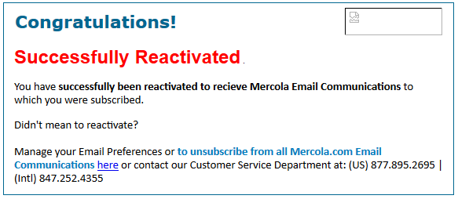

# 重新參與的最佳實務 {#re-engagement}

在實作傳遞能力時，部分最佳實務是嘗試維持健康的訂閱者基礎，並透過重新參與（或取回）策略改善傳遞能力。

* 維持健康的訂閱者基礎是確保良好一致傳遞的主要方面之一。 許多傳遞能力問題產生於糟糕的資料實務和維護。
* 行銷人員現今面臨的最常見問題之一是非作用中的訂閱者活動（也稱為低參與或未參與），可能會對電子郵件的傳送和ROI低產生負面影響。

>[!NOTE]
>
>如需重新參與行銷活動策略及Adobe傳遞能力的詳細資訊，請聯絡您的傳遞能力顧問，或洽詢您的Adobe銷售代理。

## ISP如何檢視非參與活動？ {#how-do-isps-view-non-engagement-activity-}

多年來，ISP一直使用使用者的參與回饋量度來決定要放置訊息的位置，或是否要傳送訊息。 使用者[參與](/help/engagement.md)包含正面和負面回饋，ISP會持續監視。 沒有參與可能是負面參與的主要貢獻因素之一。 從傳遞能力的角度來看，持續傳送行銷活動給沒有參與的使用者也會降低IP位址和網域的整體信譽。

Gmail、®和OATH等ISP會將非參與視為無用的電子郵件，並開始將郵件重新導向至垃圾郵件資料夾。 此外，這些訂閱者可能不再擁有電子郵件帳戶，這可用作「回收」垃圾郵件陷阱。 這表示位址在一段時間內無效，且所有訊息都會被拒絕。 如果您的訂閱者管理系統沒有移除「硬跳出」地址，郵件可能會落入垃圾郵件陷阱，進而導致重大傳送問題。

## 您應該如何處理非使用狀態？ {#how-should-you-approach-inactivity-}

使用Adobe平台的客戶可以檢閱開啟的資料，並根據區段按一下資料，檢視例項內的閒置狀態。 由於不參與可能會阻礙傳送，第一個想法可能是從資料庫移除訂閱者。 不過，這有時可能會證明是錯誤的選項。 因此，重新參與（也稱為回合）策略是保留有興趣接收郵件的訂閱者，並逐步淘汰不再顯示活動的訂閱者的最佳建議。

## 重新參與行銷活動真的有用嗎？ {#do-re-engagement-campaigns-really-work-}

根據回訪路徑研究，重新參與行銷活動最後開放率為12%，而一般行銷活動的平均開放率為14%。 雖然只有24%的訂閱者閱讀了重新參與的行銷活動，但約45%的訂閱者閱讀了後續的訊息。

## 如何建立重新參與行銷活動？ {#how-do-you-create-a-re-engagement-campaign-}

### 階段1 {#phase-1}

* 第一步是識別很少或沒有開啟或點按活動的訂閱者，並根據設定的時間範圍相應地劃分此群組。 經驗法則是檢閱過去90天內未開啟或點按過電子郵件的訂閱者。 然而，這依業務性質而異（例如，季節性傳送）。
* 定義時間範圍時請謹記的另一點是，ISP和封鎖名單公司認為參與時間介於1.5到1.8年之間。 此外，行為活動（例如購買和網站活動）或其他接觸點（例如註冊階段或第一個聯絡人期間的偏好設定）。

### 階段2 {#phase-2}

* 定義區段後，下一步就是根據已識別的量度建立適合訂閱者的重新參與行銷活動。 建立主旨列有助於提高訂閱者的興趣。 根據「回訪路徑」研究，顯示「我們很想你」的主題行與內容所產生的回應率，會高於「我們希望你回來」。
* 也可為重新使用電子郵件提供獎勵。 在考慮包含折扣的優惠方案時，最好使用金額與百分比。 回訪路徑也建議這麼做，因為它會產生較高的回應率。 最後，執行A/B分割測試以檢閱回應和成功率也是一個有用的選項。

### 階段3 {#phase-3}

下一步是決定重新參與行銷活動的頻率。 與重新確認訊息不同，重新參與行銷活動旨在隨時間透過一系列電子郵件重新贏回訂閱者。 下列範例提供頻率的範例。

透過遵循開啟或點按活動參與行銷活動的訂閱者會新增回參與訂閱者清單。

### 階段4 {#phase-4}

* 下一個階段是識別持續未顯示活動的訂閱者，並在一段時間內逐漸減少向其傳送電子郵件。 如果過去一年內沒有活動，最好將訂閱者電子郵件訂閱擱置。 雖然他們對電子郵件內容不感興趣，但總是有最後一次機會讓他們傳送一次性重新確認行銷活動，以重新啟用訂閱。
* 若訂閱者想要保留在訂閱清單中，重新確認行銷活動是詢問長期不活動的訂閱者的好方法。 建立行銷活動時，最好新增「按一下這裡」連結，以便他們確認動作並驗證其地址。 如此一來，動作便可記錄在資料庫中。 再確認電子郵件的範例如下：

  

  訂閱者採取動作後，即可提供確認其重新訂閱的登入頁面。 以下是登入頁面的範例：

  

## 產品特定資源

**Adobe Campaign**

* [在Campaign Classic中追蹤記錄](https://experienceleague.adobe.com/docs/campaign-classic/using/sending-messages/monitoring-deliveries/delivery-dashboard.html#tracking-logs)
* [在Campaign Standard中追蹤記錄](https://experienceleague.adobe.com/docs/campaign-standard/using/testing-and-sending/sending-and-tracking-messages/tracking-messages.html#tracking-logs)

**Adobe客戶歷程管理**

* [訊息追蹤](https://experienceleague.adobe.com/docs/journey-optimizer/using/reporting/message-tracking.html?lang=zh-Hant)
