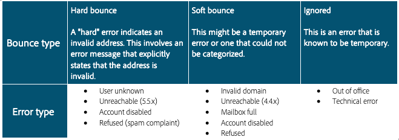

# 跳出

跳出是 ISP 提供返回故障通知的傳送嘗試和失敗的結果。 跳出處理是清單衛生的重要部分。 在指定的電子郵件連續多次跳出後，此程式會將其標示為需要抑制。 觸發抑制所需的跳出數量和類型因系統而異。 此過程會防止系統繼續傳送無效的電子郵件地址。 跳出是 ISP 用來判斷 IP 信譽的關鍵資料之一。 留意此量度非常重要。 「已傳遞」與「已跳出」可能是衡量行銷訊息傳遞方式最常見的方式：傳遞率越高越好。

我們會調查兩種不同的跳出。

## 硬跳出

硬跳出是當 ISP 將寄送訂閱者位址的嘗試判斷為無法傳送後，產生的永久性失敗。 在 Adobe Campaign，分類為無法傳送的硬跳出會新增至隔離區，這表示不會再嘗試。 在某些情況下，如果故障原因不明，則會忽略硬跳出。
以下是一些常見的硬跳出範例：

* 地址不存在
* 帳戶已停用
* 語法錯誤
* 網域錯誤

## 軟跳出

軟跳出是 ISP 在傳遞郵件時遇到的臨時故障。 軟性失敗將重試多次（如有差異，取決於使用自訂或現成可用的傳送設定），以嘗試成功傳送。 在嘗試重試次數上限之前（依設定而異），不會將持續軟跳出的位址新增至隔離。 軟跳出的常見原因包括：

* 郵箱已滿
* 接收電子郵件伺服器關閉
* 發件人信譽問題

>[!NOTE]
>
>跳出是聲譽問題的關鍵指標，因為它們可以強調不良資料來源（硬跳出）或 ISP 的信譽問題（軟跳出）。
>
>軟跳出通常會在傳送電子郵件時發生，而且應允許在重試處理期間解決，才能將其定性為真正的傳遞能力問題。 如果單一 ISP 的軟跳出率大於 30%，而且在 24 小時內無法解決，建議您向您的 Adobe Campaign 傳遞顧問提出疑問。

## 產品特定資源

**Adobe Campaign Classic**

* [無法傳送的類型和原因](https://experienceleague.adobe.com/docs/campaign-classic/using/sending-messages/monitoring-deliveries/understanding-delivery-failures.html?lang=zh-Hant#delivery-failure-types-and-reasons)
* [跳出郵件管理](https://experienceleague.adobe.com/docs/campaign-classic/using/sending-messages/monitoring-deliveries/understanding-delivery-failures.html?lang=zh-Hant#bounce-mail-management)
* [無法傳遞的項目、跳出報告](https://experienceleague.adobe.com/docs/campaign-classic/using/reporting/reports-on-deliveries/global-reports.html?lang=zh-Hant#non-deliverables-and-bounces)

**Adobe Campaign Standard**

* [無法傳送的類型和原因](https://experienceleague.adobe.com/docs/campaign-standard/using/testing-and-sending/monitoring-messages/understanding-delivery-failures.html?lang=zh-Hant#delivery-failure-types-and-reasons)
* [跳出郵件鑑定](https://experienceleague.adobe.com/docs/campaign-standard/using/testing-and-sending/monitoring-messages/understanding-delivery-failures.html?lang=zh-Hant#bounce-mail-qualification)
* [跳出摘要報吿](https://experienceleague.adobe.com/docs/campaign-standard/using/reporting/list-of-reports/bounce-summary.html?lang=zh-Hant#reporting)
