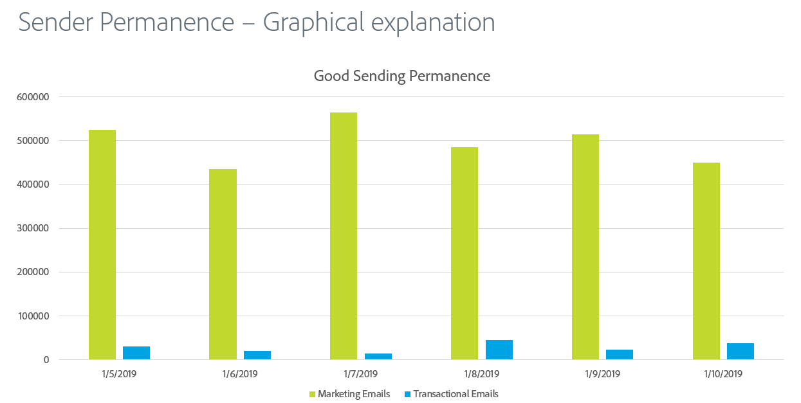

# 發件人永久性

持續傳送是建立一致的傳送數量和策略以維持ISP信譽的程式。 以下是傳送者永久性很重要的一些原因：

* 垃圾郵件傳送者通常會「IP位址躍點」，這表示他們會持續在許多IP位址間轉移流量，以避免信譽問題。
* 一致性是向ISP證明傳送者信譽良好並且不會嘗試略過任何由於傳送實務不佳而導致的信譽問題的關鍵。
* 在某些ISP認為傳送者完全可信之前，需要長期維持這些一致的策略。

**以下是一些範例：**

