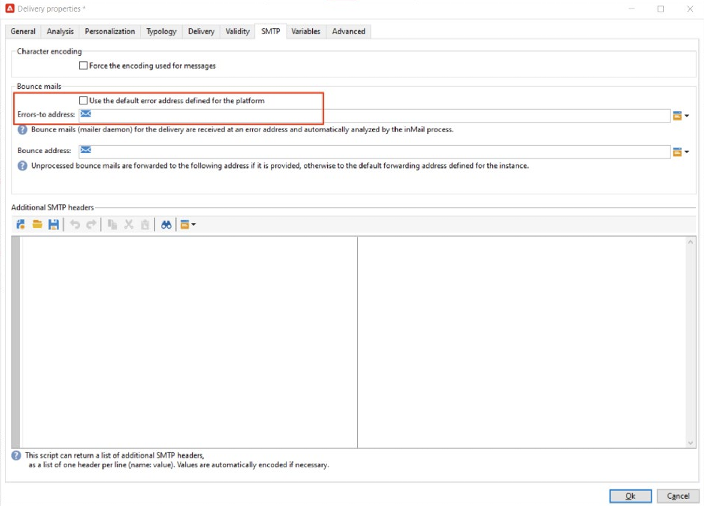

# 實作[!DNL Domain-based Message Authentication, Reporting and Conformance] (DMARC)

本檔案的用途是向讀者提供更多有關電子郵件驗證方法DMARC的資訊。 透過說明DMARC的運作方式及其各種原則選項，讀者將能更瞭解DMARC對電子郵件傳遞能力的影響。

## 什麼是DMARC？ {#about}

Domain-based Message Authentication, Reporting and Conformance是一種電子郵件驗證方法，可讓網域擁有者保護其網域免受未經授權的使用。 DMARC也提供電子郵件驗證狀態的意見回饋，並允許寄件者控制驗證失敗的電子郵件情形。 這包括監視、隔離或拒絕郵件的選項，具體取決於已實作的DMARC原則。

DMARC有三個原則選項：

* **監視器(p=none)：**&#x200B;指示信箱提供者/ISP執行他們通常對郵件執行的動作。
* **隔離（p=隔離）：**&#x200B;指示信箱提供者/ISP傳送未將DMARC傳遞給收件者的垃圾郵件或垃圾郵件資料夾的郵件。
* **拒絕(p=reject)：**&#x200B;指示信箱提供者/ISP封鎖未傳遞DMARC的郵件，導致退信。

## DMARC如何運作？ {#how}

SPF和DKIM都可用來關聯電子郵件與網域，並共同驗證電子郵件。 DMARC更進一步，並藉由比對DKIM和SPF檢查的網域，協助防止詐騙。 若要傳遞DMARC，訊息必須傳遞SPF或DKIM。 如果這兩項驗證都失敗，DMARC就會失敗，系統會根據您選取的DMARC原則傳送電子郵件。

>[!NOTE]
>
>DMARC需要在「寄件者」與「傳迴路徑」位址之間保持一致。

## 為何要實作DMARC？ {#why}

DMARC為選用，雖然並非必要，但為免費，可讓電子郵件接收者輕鬆識別電子郵件的驗證，這可能會改善傳遞。 DMARC的主要優點之一，是它可報告哪些訊息未通過SPF和/或DKIM。 它也會讓寄件者在一定程度上控制未通過任一驗證方法的郵件所發生的情況。 透過DMARC報告，傳送者可得知哪些訊息為DMARC失敗，並可採取步驟來減少進一步的錯誤。

>[!NOTE]
>
>如果您想要實施BIMI，需要p=quarantine或p=reject DMARC原則。

## 實作DMARC的最佳作法 {#best-practice}

由於DMARC是選用專案，所有ESP平台均預設不會進行此設定。 必須在DNS中為您的網域建立DMARC記錄，它才能正常運作。 此外，您需要提供您選擇的電子郵件地址，用於指示DMARC報表在組織內的放置位置。 最佳實務是
建議您將DMARC原則從p=none提升至p=quarantine及p=reject，藉此慢慢推出DMARC實施，讓DMARC瞭解DMARC的潛在影響。

1. 分析您收到並使用的意見回饋(p=none)，這會告知接收者，對於驗證失敗的訊息不執行任何動作，但仍會傳送電子郵件報告給寄件者。 此外，如果合法郵件驗證失敗，請檢閱並修正 SPF/DKIM 的問題。
1. 確定SPF和DKIM是否校準並傳遞所有合法電子郵件的驗證，然後將原則移至(p=quarantine)，這會告知接收電子郵件伺服器隔離驗證失敗的電子郵件（這通常意味著將這些郵件放在垃圾郵件資料夾中）。
1. 將原則調整為（p=拒絕）。 p=reject 原則會告訴接收者，完全拒絕 (退回) 驗證失敗的網域的所有電子郵件。 啟用此原則後，只有經過網域驗證為 100% 驗證的電子郵件才有機會進入收件匣。

   >[!NOTE]
   >
   >請謹慎使用此原則，並確定其是否適合您的組織。

## DMARC報告 {#reporting}

DMARC提供接收有關未通過SPF/DKIM之電子郵件的報表的功能。 在驗證流程中，ISP服務程式會產生兩種不同的報告，讓傳送者可透過其DMARC原則中的RUA/RUF標籤接收：

* **彙總報表(RUA)：**&#x200B;未包含任何會敏感GDPR的PII （個人識別資訊）。
* **鑑證報告(RUF)：**&#x200B;包含對GDPR敏感的電子郵件地址。 在使用之前，最好是在內部檢查如何處理需要符合GDPR的資訊。

這些報告的主要用途是接收企圖詐騙的電子郵件概觀。 這些是高度技術性的報告，最好透過協力廠商工具消化。 少數專門DMARC監控的公司包括：

* [ValiMail](https://www.valimail.com/products/#automated-delivery)
* [阿加里文](https://www.agari.com/)
* [Dmarcian](https://dmarcian.com/)
* [校樣](https://www.proofpoint.com/us)

>[!CAUTION]
>
>如果您新增用於接收報告的電子郵件地址位於為其建立 DMARC 記錄的網域之外，您需要授權其外部網域指定您擁有該網域的 DNS。 為此，請按照以下詳細步驟操作 [dmarc.org 檔案](https://dmarc.org/2015/08/receiving-dmarc-reports-outside-your-domain)

### DMARC記錄範例 {#example}

```
v=DMARC1; p=reject; fo=1; rua=mailto:dmarc_rua@emaildefense.proofpoint.com;ruf=mailto:dmarc_ruf@emaildefense.proofpoint.co
```

## DMARC標籤及其功用 {#tags}

DMARC記錄有多個稱為DMARC標籤的元件。 每個標籤都有一個值，可指定DMARC的特定面向。

| 標籤名稱 | 必要/選用 | 函數 | 範例 | 預設值 |
|  ---  |  ---  |  ---  |  ---  |  ---  |
| v | 必要 | 此DMARC標籤會指定版本。 目前只有一個版本，因此其固定值為v=DMARC1 | V=DMARC1 DMARC1 | DMARC1 |
| p | 必要 | 顯示選取的DMARC原則，並指示接收者報告、隔離或拒絕驗證檢查失敗的郵件。 | p=none、quarantine或reject | - |
| fo | 選填 | 允許網域擁有者指定報告選項。 | 0：如果一切失敗，則產生報表<br/>1：如果一切失敗，則產生報表<br/>d：如果DKIM失敗，則產生報表<br/>s：如果SPF失敗，則產生報表 | 1 （建議用於DMARC報表） |
| pct | 選填 | 告知受篩選的訊息百分比。 | pct=20 | 100 |
| 規則 | 選用（建議） | 識別彙總報表的傳送位置。 | `rua=mailto:aggrep@example.com` | - |
| ruf | 選用（建議） | 識別將傳送鑑證報告的位置。 | `ruf=mailto:authfail@example.com` | - |
| sp | 選填 | 指定上層網域之子網域的DMARC原則。 | sp=reject | - |
| adkim | 選填 | 可以是嚴格(s)或寬鬆(r)。 寬鬆的對齊表示DKIM簽章中使用的網域可以是「寄件者」位址的子網域。 嚴格對齊表示DKIM簽章中使用的網域必須與寄件者地址中使用的網域完全相符。 | adkim=r | r |
| aspf | 選填 | 可以是嚴格(s)或寬鬆(r)。 寬鬆的對齊表示ReturnPath網域可以是「寄件者地址」的子網域。 嚴格對齊表示傳迴路徑網域必須與寄件者位址完全相符。 | aspf=r | r |

## DMARC與Adobe Campaign {#campaign}

>[!NOTE]
>
>如果您的Campaign執行個體託管於AWS上，則可以使用控制面板為子網域實作DMARC。 [瞭解如何使用控制面板](https://experienceleague.adobe.com/docs/control-panel/using/subdomains-and-certificates/txt-records/dmarc.html?lang=zh-Hant)實作DMARC記錄。

DMARC失敗的常見原因在於「寄件者」與「錯誤收件者」或「傳迴路徑」位址之間未對齊。 若要避免此問題，在設定DMARC時，建議在傳遞範本中仔細檢查您的「寄件者」和「寄件者錯誤」位址設定。

1. 在您的傳遞範本中，檢閱目前設定為您的「寄件者」地址。

   

1. 從這裡，選取「屬性」，您就可以進一步編輯傳遞範本。 在此視窗中，選取SMTP，並取消勾選「使用為平台定義的預設錯誤地址」（如果選取）。 Adobe Campaign中的傳遞範本預設會選取此核取方塊。 預設的錯誤地址可能不是與此傳遞範本中的寄件者地址關聯的地址。

   

1. 取消核取此方塊時，會出現一個文字欄位，可讓您輸入唯一的錯誤地址，此地址使用與「寄件者地址」中設定的相同網域。

   

儲存這些變更後，您就能透過正確的網域對齊來繼續進行DMARC實施。

## 有用的連結 {#links}

* [DMARC.org](https://dmarc.org/){target="_blank"}
* [M3AAWG電子郵件驗證](https://www.m3aawg.org/sites/default/files/document/M3AAWG_Email_Authentication_Update-2015.pdf){target="_blank"}
